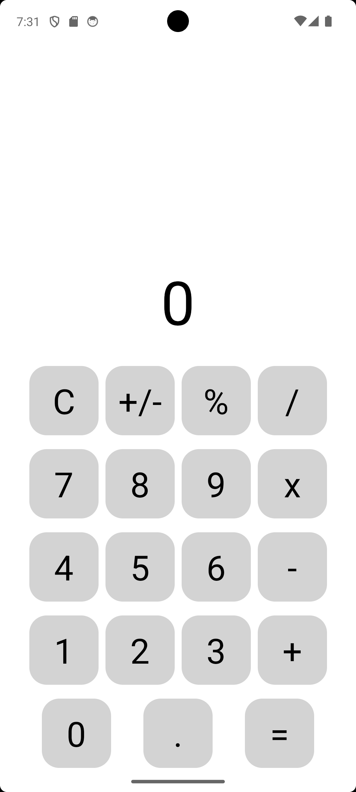

# Hesap Makinesi Uygulaması

Kullanıcıların  4 işlem diye tabir ettiğimiz ifadeleri yapabilen bir uygulamadır

## 📱 Ekran Görüntüleri

## ✨ Özellikler

* Ekran temizleme 
* Toplama,çıkarma,çarpma ve bölme işlemleri

## 🛠️ Kullanılan Teknolojiler

* React Native
* Expo go
* JavaScript
* React Navigation
* React Hooks (`useState`, `useEffect`)

